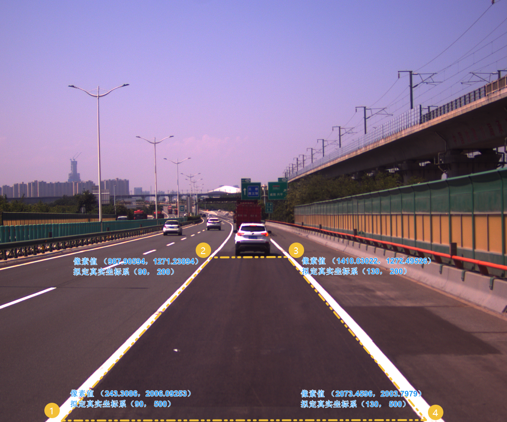
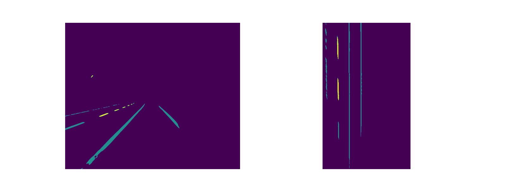

# 一文搞懂基于透视变换的车道线拟合

> 文章代码👉 [laugh12321/RoadLaneFitting](https://github.com/laugh12321/RoadLaneFitting/blob/main/RoadLaneFitting.ipynb) 欢迎star ✨


## 将前视图转为鸟瞰图

将前视图转为鸟瞰图的方法有两种：

- 有标定的情况下，可以直接使用标定参数进行转换。
- 没有标定的情况下，可以选择四个点计算透视变换矩阵来进行转换。

在没有标定的情况下，透视变换需要使用一个3x3的变换矩阵，确保直线在变换后仍然保持直线的性质。为了得到这个变换矩阵，需要在输入图像上选择4个点，并提供它们在输出图像上的对应点。这4个点中，至少有3个点不能共线。通过使用`cv2.getPerspectiveTransform`函数，可以计算出这个变换矩阵，随后可以通过`cv2.warpPerspective`将其应用于图像。

简而言之，透视变换需要选取4个非共线的点，并通过这些点之间的映射关系来计算变换矩阵，最终应用于图像。

<div style="text-align: center;">
    
</div>

以上图为例，选择1，2，3，4四个点，用以进行透视变换。经查阅，高速公路上的白色虚线标准长度为长度6米，间隔9米。高速公路单条车道宽度是3.75米。这里假定，直线14，直线23长4米，直线12，直线34长30米。则输入图像与输出图像点的坐标如上图所示。

```python
# GET MATRIX
src = np.float32([
    (243.3086, 2006.09253), (987.90594, 1271.23894),
    (1410.03022, 1272.49526), (2073.4596, 2003.7979)
])
dst = np.float32([
    (90, 500), (90, 200), (130, 200), (130, 500)
])
Matrix = cv2.getPerspectiveTransform(src, dst)

warped_image = cv2.warpPerspective(image, Matrix, (300, 500))
```

<div style="text-align: center;">
    
</div>

## 车道线定位

假设已经获得了车道线的分割图像，并将其转换为鸟瞰图。

<div style="text-align: center;">
    
</div>

现在有了车道线分割图的鸟瞰图，那么如何确定当前有几条车道线以及车道线所处的位置呢？

可以对鸟瞰图进行垂直方向的累加投影。理论上，有几个峰值就有几条车道线，而峰值点的位置即为车道线的位置坐标。

<div style="text-align: center;">
    
</div>

从上图可以看出，一共有四条车道线，且车道线的大致位置也是已知的。之后可以通过滑动窗口法，以峰值点为起点对车道线的点进行搜索。

滑动窗口法的工作原理如下：

1. 设置窗口大小
    - 确定窗口的宽度和高度，通常是矩形区域。
    - 窗口的高度可以根据图像的大小和问题的特定要求进行调整。
2. 滑动窗口
    - 从图像底部开始，以固定步长（通常是一个窗口的高度）向上滑动窗口。
    - 对于每个窗口，统计窗口内的非零像素的个数
3. 更新窗口
    - 若窗口内的非零像素数量超过阈值，更新窗口中心位置为当前窗口内非零像素的平均横坐标。
4. 拟合曲线
    - 针对每个滑动窗口内的非零像素，使用 `np.polyfit` 对这些点进行二阶多项式拟合，得到曲线的系数。

```python
def finding_line(warped_mask, x_points, sliding_window_num=9, margin=15, min_pixels_threshold=50):
    # 获取图像的高度和宽度
    height, width = warped_mask.shape

    # 获取图像中所有非零像素的坐标
    nonzero_y, nonzero_x = np.nonzero(warped_mask)

    # 计算滑动窗口的高度
    sliding_window_height = height // sliding_window_num

    # 用于存储每个滑动窗口内的像素索引
    line_pixel_indexes = [[] for _ in range(len(x_points))]

    # 遍历滑动窗口
    for i in range(sliding_window_num):
        for idx, x_point in enumerate(x_points):
            # 确定窗口在y轴上的边界
            top, bottom = height - (i + 1) * sliding_window_height, height - i * sliding_window_height

            # 确定窗口在x轴上的边界
            left, right = x_point - margin, x_point + margin

            # 获取窗口内的非零像素索引
            window_pixel_indexes = ((nonzero_y >= top) & (nonzero_y < bottom) &
                                    (nonzero_x >= left) & (nonzero_x < right)).nonzero()[0]

            # 存储当前窗口内的像素索引
            line_pixel_indexes[idx].append(window_pixel_indexes)

            # 如果像素数量足够，更新窗口中心位置
            if len(window_pixel_indexes) > min_pixels_threshold:
                x_point = int(np.mean(nonzero_x[window_pixel_indexes]))

    # 用于存储拟合的曲线系数
    lines = []

    # 处理每个滑动窗口的像素索引
    for line_pixel_index in line_pixel_indexes:
        # 合并像素索引
        line_pixel_index = np.concatenate(line_pixel_index)

        # 提取坐标
        line_x, line_y = nonzero_x[line_pixel_index], nonzero_y[line_pixel_index]

        # 使用多项式拟合曲线，并将结果添加到lines中
        lines.append(np.polyfit(line_y, line_x, 2))

    return lines
```

<div style="text-align: center;">
    
</div>

上述为拟合后的车道线在鸟瞰图上的效果。

## 复杂情况

<div style="text-align: center;">
    
</div>

然而，上述结果是在理想条件下（车道线分割结果准确无误、车道线曲率不大）得到的结果。当情况复杂时，直接以峰值点作为车道线的个数以及大致位置的方式可能行不通。


<div style="display: flex; align-items: center; justify-content: center;">
    
    
</div>

从上图可以发现，实际共有5条车道线，但得到了10个峰值点，且拟合出的10条曲线有3条是重叠的（红色、棕色分别重叠2、1次）。

根据这些信息，可以采取两种解决办法：

- 在拟合前进行过滤
- 在拟合后进行过滤

### 在拟合前进行过滤

通过直方图不难看出，车道线的间距在20~30像素，且每条车道线的峰值像素个数不小于50。可以根据这些关系对数据进行过滤。

<div style="text-align: center;">
    
</div>

### 在拟合后进行过滤

由于使用二阶多项式对车道线拟合， 而二阶多项式系数在二次多项式方程中具有几何意义，这个方程一般表示为：

$$
	f(x) = ax^2 + bx + c
$$

其中，$a$, $b$, 和 $c$ 是系数，决定了二次多项式的形状。系数的组合产生了不同形状和位置的二次曲线，反映了二次多项式方程在平面上的几何特征。

上文我们已经知道了车道线的间距在20~30像素，可以通过比较相邻两二次多项式在 $0 < f(x) < \text{{height}}$ 的情况下，以x的最大值作差，作为两车道线的间距。若间距小于20，则代表是一条车道线，保留其中系数 b 最接近于0的（曲率最小的）作为车道线。

<div style="text-align: center;">
    
</div>


## 将拟合后的车道线投影到原图上

在完成车道线的拟合后，可以将拟合出的车道线投影回原始图像中。这个过程涉及逆透视变换，将鸟瞰图上的车道线投影回原始图像上。


<div style="text-align: center;">
    
</div>
